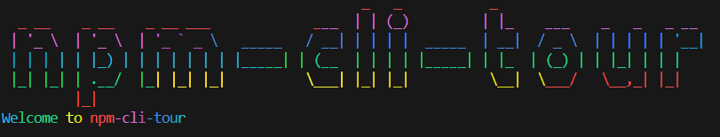

# npm cli tour



## Introduction

npm-cli-tour is a command line tool that helps you to understand the npm commands. It provides a step by step guide to understand the npm commands and their usage.

## Getting Started

Open your terminal and run the following command :

```node
npx npm-cli-tour
```

## Commands

The npm-cli-tour package currently supports the 4 basic npm commands.

1. npm init
2. npm install
3. npm install --save-dev
4. npm uninstall

# Contributing

Contributions are welcome! raise an issue and send a pull request 🎉.

Support the project by giving a ⭐️ and sharing it with your friends!
